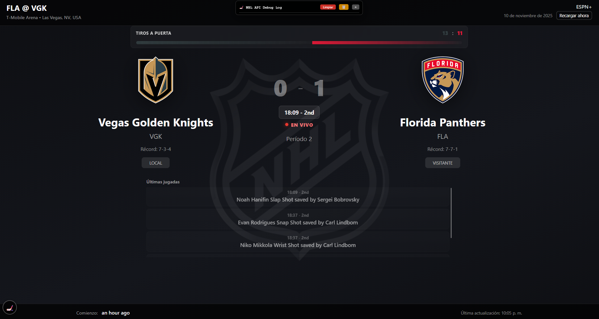
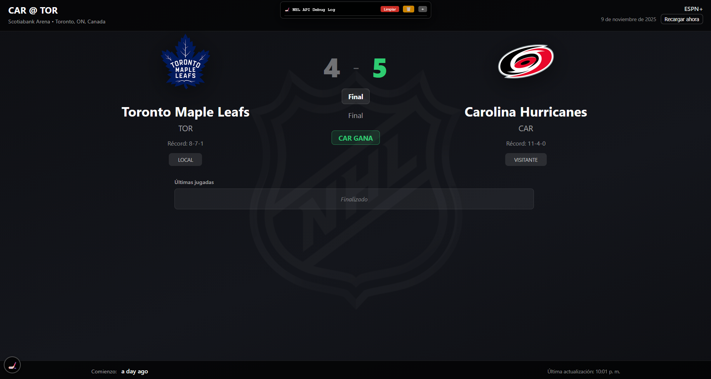

# 🏒 NHL Live Game Panel for Home Assistant

A beautiful, real-time NHL game tracking panel for Home Assistant that displays live scores, shots, power plays, penalties, and play-by-play updates directly on your Home Assistant dashboard.

> **Note:** This is a hobby project created by a non-programmer with the help of AI (Claude). It's designed to work seamlessly with Home Assistant and requires no external dependencies beyond the NHL API.

## ✨ Features

- 🎮 **Live Game Tracking** - Real-time scores and game status
- 📊 **Advanced Statistics** - Shots on goal with visual bars
- ⚡ **Power Play Indicators** - Dynamic cards showing 5v4, 5v3, etc.
- 📝 **Play-by-Play Updates** - Latest 10 plays with timestamps
- 🎨 **Team Colors** - Dynamic background and styling based on teams
- 🏆 **Winner Animations** - Goal detection with border flash effects
- 🌐 **Timezone Support** - Automatic conversion to your local timezone (GMT-6 by default)
- 📱 **Responsive Design** - Optimized for tablets (10" recommended)
- 🔄 **Smart Refresh** - 15s during live games, 2min pre-game, 5min post-game
- 🏠 **100% Local** - All data processed through Home Assistant sensors

## 📸 Screenshots

### Live Game View


### Power Play Indicator


### Post-Game Status


### Post-Game Status


## 🚀 Quick Start

### Prerequisites

- Home Assistant installed and running
- Access to Home Assistant configuration files
- A Long-Lived Access Token from Home Assistant
- Team Tracker integration (to render team logos, play-by-play events, and other ones)
- Add your favorite team sensors from Team Tracker integration

### Installation

1. **Clone repo or download the HTML file**

2. **Copy the HTML (choose your language) file to your Home Assistant `www` folder**

3. **Add the REST sensors to your `configuration.yaml`**
   ```yaml
   # Add this to your configuration.yaml
   rest:
     # Schedule sensor (detects games)
     - resource: https://api-web.nhle.com/v1/schedule/now
       scan_interval: 300  # 5 minutes
       sensor:
         - name: "NHL Schedule Now"
           unique_id: nhl_schedule_now
           value_template: >-
             
               {{ value_json.gameWeek | length }} games
             
               No data
             
           json_attributes:
             - gameWeek
             - nextStartDate
             - previousStartDate
       
     # Play-by-play sensor (live game data)
     - resource_template: >-
         
         
         https://api-web.nhle.com/v1/gamecenter/{{ game_id }}/play-by-play
         
         https://api-web.nhle.com/v1/schedule/now
         
       scan_interval: 15  # 15 seconds during live games
       sensor:
         - name: "NHL Play by Play"
           unique_id: nhl_play_by_play
           value_template: >-
             
               {{ value_json.plays | length }} plays
             
               Waiting
             
           json_attributes:
             - plays
             - homeTeam
             - awayTeam
             - clock
             - gameState
             - period
             - periodDescriptor
             - situation

   # Input helpers
   input_text:
     nhl_current_game_id:
       name: NHL Current Game ID
       initial: ""
       max: 50

   input_boolean:
     nhl_game_active:
       name: NHL Game Active
       initial: false
       icon: mdi:hockey-puck

   input_select:
     nhl_team:
       name: NHL Team
       options:
         - "Winnipeg Jets"
         - "Vegas Golden Knights"
         - "Toronto Maple Leafs"
         - "Montreal Canadiens"
         - "Edmonton Oilers"
         - "Calgary Flames"
         - "Vancouver Canucks"
         - "Ottawa Senators"
         # Add more teams as needed
   ```

4. **Configure the HTML file**
   
   Edit `nhl.html` and update these values at the top:
   ```javascript
   const HA_URL = 'http://YOUR_HA_IP:8123';  // Your Home Assistant URL
   const HA_TOKEN = 'YOUR_LONG_LIVED_TOKEN'; // Your Long-Lived Access Token
   const INPUT_SELECT = 'input_select.nhl_team'; // Your team selector entity (use the sensors created from Team Tracker Integration)
   ```

5. **Restart Home Assistant**
   ```
   Developer Tools → YAML → Restart
   ```

6. **Access the panel**
   
   Navigate to: `http://YOUR_HA_IP:8123/local/nhl.html`

## ⚙️ Configuration

### Team Selection

The panel reads from an `input_select` entity. You can change teams by:

1. **Through Home Assistant UI:**
   - Go to Developer Tools → States
   - Find `input_select.team_nhl`
   - Select your team

2. **Through the HTML:**
   - The panel automatically detects the selected team
   - You can use team names or abbreviations (e.g., "VGK", "WPG", "TOR")

### Telegram Notifications (Optional)

If you want goal and its highlight notifications via Telegram:

1. Set up Telegram Bot integration in Home Assistant
2. Update the `sendTelegramNotification()` function in the HTML:
   ```javascript
   config_entry_id: 'YOUR_TELEGRAM_CONFIG_ID',
   target: ['YOUR_CHAT_ID'],
   ```

### Timezone Adjustment

The panel is configured for GMT-6 by default. To change:

1. Find the `convertClockTimeZone()` function
2. Adjust the `offsetMinutes` calculation based on your timezone

## 🎨 Customization

### Colors and Styling

Team colors are applied automatically based on your team sensor attributes. You can customize:

- Background gradients in CSS
- Card styles and animations
- Font sizes for different screen sizes

### Refresh Intervals

Current settings:
- **Live games**: 15 seconds
- **Pre-game**: 2 minutes
- **Post-game**: 5 minutes

Adjust in the `updatePanel()` function if needed.

## 🔧 Troubleshooting

### Panel shows "Connecting to Home Assistant"

- Check your `HA_URL` and `HA_TOKEN` are correct
- Verify Home Assistant is accessible from your browser
- Check browser console for errors (F12)

### No game found

- Verify your team name matches the NHL API format
- Try using team abbreviation (e.g., "VGK" instead of "Vegas Golden Knights")
- Check the debug log (hockey puck icon bottom-left)

### Power Play cards not appearing

- Ensure `situationCode` is being parsed correctly
- Check debug log for "Power Play activo" messages
- Verify the play-by-play sensor is updating

### API rate limiting

If you see connection errors:
- The NHL API has rate limits
- Refresh intervals are optimized to stay under limits
- If issues persist, increase scan intervals in `configuration.yaml`

## 📱 Recommended Setup

### Best Experience

- **Device**: 10" tablet (1280x800 or higher)
- **Browser**: Chrome/Edge/Firefox (tested working)
- **Mount**: Wall-mounted near TV for game viewing (or anything you want)
- **Network**: WiFi

### Home Assistant Dashboard Integration (if you want it as dashboard, you can use it with full screen browser)

Add as an iframe card:
```yaml
type: iframe
url: http://YOUR_HA_IP:8123/local/nhl.html
aspect_ratio: 16:9
```

## 🤝 Contributing

This is a hobby project, but contributions are welcome! 

- 🐛 Report bugs via Issues
- 💡 Suggest features via Issues
- 🔧 Submit Pull Requests with improvements
- ⭐ Star the repo if you find it useful!

## 📝 Credits

- **NHL API**: Official NHL statistics API
- **Home Assistant**: Amazing home automation platform
- **Claude AI**: Helped a non-programmer build this project
- **Community**: Home Assistant community for inspiration

## ⚠️ Disclaimer

This project is not affiliated with or endorsed by the NHL. It uses publicly available NHL API data for personal, non-commercial use. Team logos and names are property of their respective owners.

## 📄 License

MIT License - feel free to use and modify for personal use.

## 🌟 Show Your Support

If this project helped you enjoy NHL games more on your Home Assistant setup, consider:

- ⭐ Starring the repository
- 🐛 Reporting issues you find
- 📢 Sharing with other Home Assistant / NHL fans
- ☕ Buying me a coffee [(paypal) ](https://paypal.me/kevvarfer)

---

**Made with 🏒 and 🤖 AI assistance**
